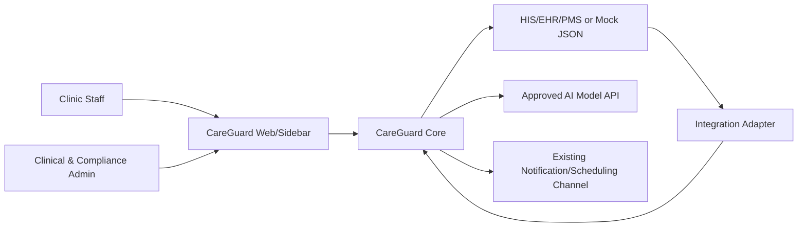
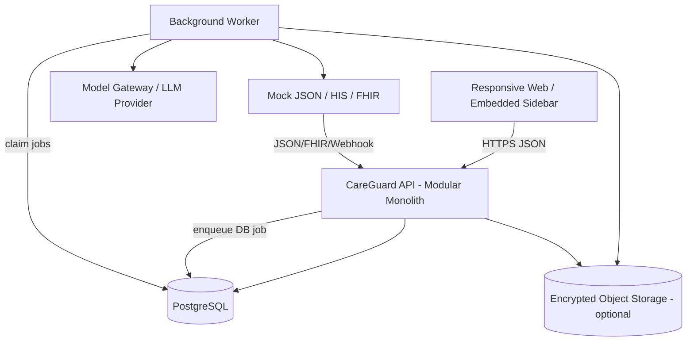
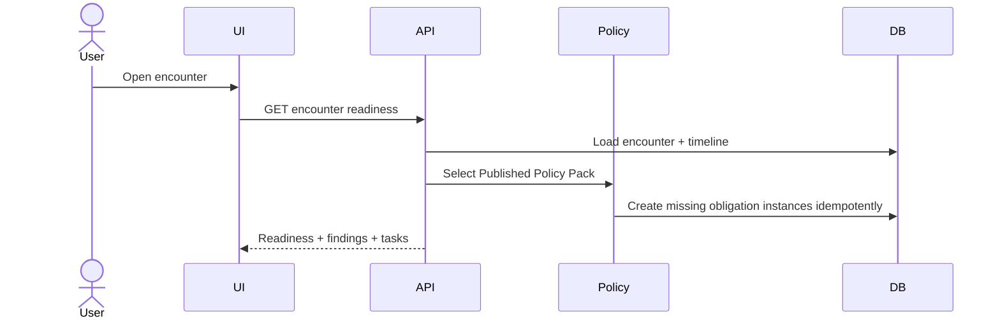
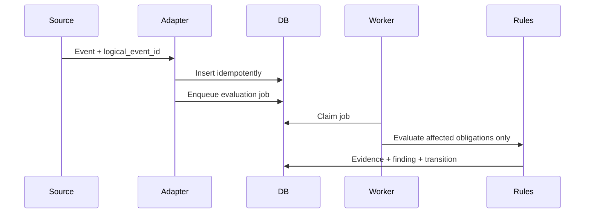
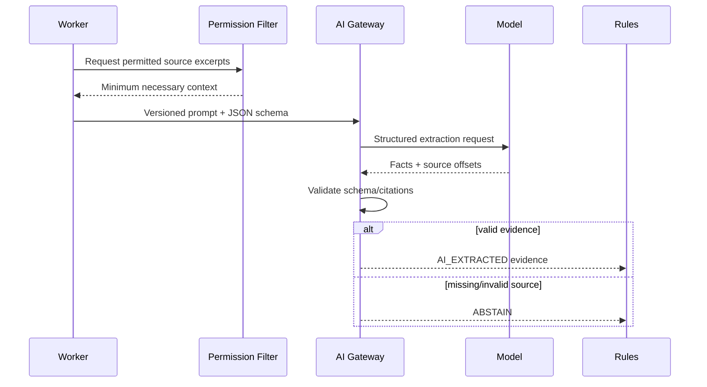

# CareGuard — Thiết kế kiến trúc hệ thống

> Phiên bản: 1.0
> Ngày: 17/07/2026
> Tài liệu liên quan: [Đặc tả sản phẩm](2026-07-17-clinical-compliance-copilot-design.md), [Đặc tả database](2026-07-17-careguard-database-design.md)

## 1. Mục tiêu kiến trúc

Kiến trúc phải chứng minh được ba điều:

1. CareGuard nhúng vào quy trình hiện có, không thay HIS/EHR.
2. AI tìm evidence và giải thích; deterministic rule cùng con người giữ quyền quyết định.
3. Mọi kết luận có thể tái hiện từ policy version, dữ liệu nguồn và audit trail.

MVP là một modular monolith với một worker và PostgreSQL. Đây là ranh giới triển khai, không phải ranh giới domain; module vẫn có interface rõ để tách sau khi có nhu cầu thực tế.

## 2. System context



External systems remain authoritative for patient identity, signed clinical documents, results, appointments and prescriptions. CareGuard stores references, evaluation state, tasks and audit metadata.

## 3. Container architecture



### 3.1 Web application

- Worklist theo role.
- Encounter readiness và step-by-step timeline.
- Finding detail: reason, evidence, citation và action.
- Resolve/Not applicable/Override.
- Policy editor/review/publish cho admin.
- Dashboard tổng hợp không lộ PHI.

Không xây patient portal, chat platform hoặc rich clinical editor trong MVP.

### 3.2 API modular monolith

| Module | Trách nhiệm |
| --- | --- |
| Identity & Access | Xác thực token, tenant context, role/permission |
| Encounter | Patient reference, encounter và timeline |
| Policy | Policy Pack lifecycle, rule validation, version selection |
| Evidence | Thu nhận structured evidence và AI-extracted evidence |
| Compliance | Applicability, obligation state và finding |
| Task | Owner, handoff, SLA, escalation và completion |
| Integration | Mock/FHIR adapter, idempotency, ACK và reconciliation |
| AI Gateway | Model allowlist, schema, timeout, citation và abstain |
| Audit | Append-only security/business audit |
| Analytics | Aggregate KPI từ operational data |

Module không đọc bảng của module khác trực tiếp ngoài repository/application interface đã định nghĩa. Trong MVP, điều này là convention và test boundary, không cần network service.

### 3.3 Worker

Worker xử lý:

- Ingest/reconciliation không đồng bộ.
- Re-evaluation khi timeline thay đổi.
- AI evidence extraction.
- Task escalation.
- Notification handoff.
- Retention/deletion jobs.

Queue MVP dùng bảng `integration_jobs`/job table với `FOR UPDATE SKIP LOCKED`. Chỉ thêm broker khi throughput hoặc fan-out đo được vượt khả năng DB queue.

## 4. Luồng runtime

### 4.1 Mở encounter



Nếu không tìm thấy Policy Pack đã publish, UI hiển thị `No approved policy` và không giả lập compliance score.

### 4.2 Nhận event và đánh giá lại



Re-evaluation là incremental: event loại nào chỉ đánh giá obligation phụ thuộc vào loại evidence đó. Full encounter evaluation vẫn có ở pre-close để bảo đảm nhất quán.

### 4.3 AI evidence extraction



AI output không trực tiếp cập nhật final obligation state. Rule engine áp dụng evidence hierarchy; AI evidence thường tạo `UNVERIFIED`.

### 4.4 Pre-close

1. API khóa optimistic version của encounter.
2. Chạy full deterministic evaluation.
3. Nhóm finding theo Must resolve, Needs review, Follow-up.
4. User sửa dữ liệu nguồn hoặc ghi human decision.
5. Re-evaluate và trả trạng thái mới.
6. Chỉ source system đóng hồ sơ; CareGuard ghi ACK và audit.

### 4.5 Follow-up và escalation

- Task tạo từ finding bằng idempotency key `encounter:obligation:policy_version`.
- Scheduler tìm task quá hạn.
- Escalation cập nhật cùng task và thêm `task_event`, không clone task.
- Notification chỉ chứa nội dung privacy-safe và deep link.
- Completion yêu cầu evidence hoặc quyết định hợp lệ.

## 5. Interfaces

### 5.1 Mock encounter contract

```json
{
  "eventId": "evt-ent-001",
  "eventType": "ENCOUNTER_SNAPSHOT_RECEIVED",
  "occurredAt": "2026-07-17T08:00:00Z",
  "organizationId": "org-demo",
  "facilityId": "clinic-demo",
  "encounter": {
    "id": "enc-ent-001",
    "patientRef": "patient-001",
    "specialty": "ENT",
    "type": "EAR_PAIN_VISIT",
    "status": "OPEN"
  },
  "facts": {
    "consentStatus": "SIGNED",
    "allergyReviewStatus": "CONFIRMED",
    "otoscopyResult": null
  }
}
```

Ba fixture chỉ thay specialty, encounter type và facts. Production adapter map FHIR/HIS data vào contract này.

### 5.2 API surface MVP

| Method | Endpoint | Mục đích |
| --- | --- | --- |
| POST | `/api/v1/events` | Ingest mock/webhook event idempotently |
| GET | `/api/v1/encounters/{id}` | Encounter overview |
| GET | `/api/v1/encounters/{id}/readiness` | Obligations/findings/tasks hiện tại |
| POST | `/api/v1/encounters/{id}/evaluate` | Full pre-close evaluation |
| POST | `/api/v1/findings/{id}/decisions` | Resolve/not-applicable/override |
| GET | `/api/v1/tasks` | Worklist theo owner/role/status |
| POST | `/api/v1/tasks/{id}/acknowledge` | Nhận handoff |
| POST | `/api/v1/tasks/{id}/complete` | Đóng bằng evidence/decision |
| GET | `/api/v1/policy-packs` | Danh sách/version |
| POST | `/api/v1/policy-packs/{id}/versions/{v}/publish` | Publish có authorization |
| GET | `/api/v1/audit-events` | Search audit theo quyền |

POST có side effect yêu cầu `Idempotency-Key`. PATCH/decision dùng encounter/finding version để tránh lost update.

### 5.3 Error contract

```json
{
  "code": "EVIDENCE_REQUIRED",
  "message": "Required evidence is missing",
  "retryable": false,
  "correlationId": "uuid",
  "details": {"findingId": "uuid"}
}
```

Không trả stack trace, PHI hoặc source text trong error.

## 6. Rule engine

Rule engine là code deterministic đọc DSL giới hạn trong database:

- Boolean: `all`, `any`, `not`.
- Comparison: `eq`, `in`, `exists`.
- Evidence: type, status, freshness, minimum count.
- Output: applicable, required evidence, target state, severity, owner và due date.

Không thực thi JavaScript/Python hoặc SQL được lưu trong policy. Policy publish phải validate schema, field allowlist và citation.

## 7. Security và privacy

### Trust boundaries

- Browser không quyết định tenant/role.
- Adapter không được tin payload tenant từ body nếu credential đã pin tenant.
- Model provider không có DB/network access.
- AI output luôn là untrusted input cần schema validation.
- Analytics không đọc raw clinical text.

### Controls

- OIDC, short-lived access token và MFA theo role.
- Backend RBAC + encounter/facility scope.
- PostgreSQL RLS cho tenant isolation.
- TLS, KMS-managed encryption và secret manager.
- No-PHI application logs.
- Audit view, export, decision, policy publish và support access.
- Model contract: no training/secondary use mặc định, retention và region được phê duyệt.
- Prompt injection defense: source text được đóng vai dữ liệu; không có model tool gọi write API.

## 8. Reliability và failure modes

| Failure | Hành vi |
| --- | --- |
| AI timeout | Mark run failed/abstained; deterministic checklist vẫn hoạt động |
| Source unavailable | Hiển thị stale state; queue retry; không báo Synced |
| Duplicate event | Unique constraint trả kết quả cũ, không chạy side effect trùng |
| Conflicting event | Lưu conflict finding; không overwrite im lặng |
| Worker crash | Job lease hết hạn và worker khác nhận lại idempotently |
| Policy lỗi | Chặn publish; runtime giữ published version trước |
| Notification lỗi | Task vẫn tồn tại; retry notification, không mất SLA |
| Database outage | UI read-only/error rõ; phòng khám dùng checklist manual |

## 9. Deployment

### Prototype

```text
1 web container
1 API container
1 worker container
1 PostgreSQL instance
optional object storage
approved model API
```

Docker Compose hoặc một managed container platform là đủ. Không cần Kubernetes, service mesh, Kafka hoặc multi-region.

### Production evolution

Chỉ nâng cấp khi có số đo:

- Managed HA PostgreSQL + PITR.
- Tách worker pool khi AI/job backlog ảnh hưởng API.
- Object storage lifecycle/WORM cho artifact cần giữ.
- Broker khi DB queue không đáp ứng throughput/fan-out.
- Dedicated tenant data plane khi hợp đồng yêu cầu.

## 10. Observability

### Metrics

- API latency/error rate.
- Event ingest duplicate/conflict rate.
- Evaluation latency và findings theo state/severity.
- AI abstain, schema failure, source coverage, latency và cost.
- Job queue depth/age/retry/dead-letter.
- Task SLA, acknowledgment và escalation.
- Policy version adoption và override rate.

### Logging/tracing

- Structured allowlist log với correlation ID.
- Trace: request → ingest → evaluation → AI run → finding → task → decision.
- Không đưa patient ID, note text, evidence excerpt hoặc prompt vào trace/log.

### Alerts

- Không ingest được event.
- Queue oldest age vượt SLO.
- AI schema/citation failure tăng đột biến.
- Hard-stop false-positive feedback tăng.
- Cross-tenant denial hoặc bulk audit access bất thường.

## 11. Kiểm thử kiến trúc

1. Contract tests cho ba mock JSON cùng schema.
2. Rule unit tests cho applicability, evidence hierarchy và state transition.
3. End-to-end: event → finding → human decision → task → audit.
4. Failure injection: duplicate event, AI timeout, worker restart, source 503.
5. Authorization: role, facility scope, cross-tenant denial và hard-stop override.
6. AI safety: missing citation, prompt injection, malformed JSON và abstain.
7. Database: idempotency, immutable audit, policy pinning và RLS.
8. Accessibility: keyboard, focus, non-color status và screen-reader labels.

## 12. ADR

| ADR | Quyết định | Lý do |
| --- | --- | --- |
| ADR-001 | Modular monolith | Ít vận hành, transaction/audit đơn giản, đủ cho MVP |
| ADR-002 | PostgreSQL job queue | Không thêm broker trước khi có throughput cần thiết |
| ADR-003 | Deterministic compliance engine | Tái hiện được và không trao hard-stop cho LLM |
| ADR-004 | AI evidence là Unverified mặc định | Ngăn automation bias |
| ADR-005 | Source system giữ quyền ghi lâm sàng | CareGuard không trở thành EHR |
| ADR-006 | Version mọi policy/model/prompt | Audit và rollback |
| ADR-007 | One shared engine, three Policy Packs | Tránh ba implementation khác nhau |
| ADR-008 | Mock JSON contract trước, FHIR adapter sau | Demo ổn định và giữ đường nâng cấp rõ |

## 13. Definition of Done kiến trúc

- Ba fixtures đi qua cùng ingest/evaluation path.
- Không có module hoặc model nào bypass authorization/audit.
- Rule engine chạy không cần AI.
- AI failure không chặn checklist/manual workflow.
- API, DB và tài liệu dùng cùng state/entity names.
- Idempotency và correlation ID xuyên suốt event, job, finding và task.
- Security, failure và end-to-end tests quan trọng pass.
- Kiến trúc prototype chạy được với tối đa năm thành phần triển khai nêu trên.
