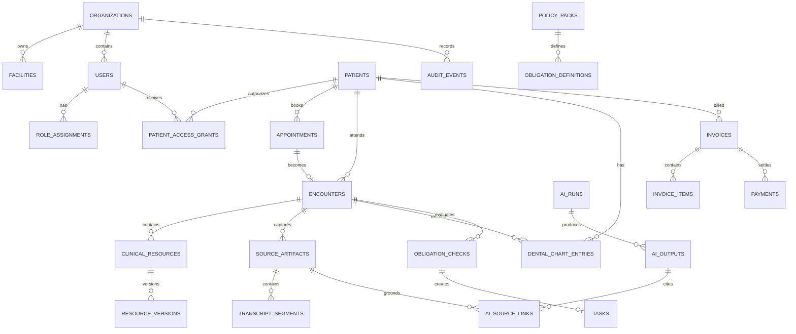

# CareGuard — Đặc tả Database HIS/EHR/PMS, Patient Portal & AI

> Phiên bản: 2.0
> Database: PostgreSQL 16+
> Binary storage: S3-compatible object storage; DICOMweb/PACS khi có
> Tài liệu nguồn: [design.md](design.md)

## 1. Kết luận Ponytail

Database v1 tối ưu cho compliance overlay nhưng không thể làm system of record: chỉ có `patient_refs`, không có patient portal, scheduling, billing, clinical record đầy đủ, nha khoa hoặc nguồn dữ liệu AI.

Thiết kế v2 dùng một PostgreSQL, không microservice database, graph database hoặc vector database riêng:

- **Chuẩn hóa** dữ liệu cần transaction/query mạnh: patient, appointment, encounter, invoice, payment, task.
- **Một resource contract** cho clinical data thay đổi theo chuyên khoa: `clinical_resources` với FHIR-shaped JSON được validate.
- **Bảng riêng tối thiểu** cho nha khoa và dữ liệu phi cấu trúc vì chúng có query/constraint đặc thù.
- Media không lưu trong PostgreSQL; chỉ lưu metadata, hash, URI bảo vệ và provenance.

## 2. Quy ước

- UUID primary key; `timestamptz` UTC; `snake_case`.
- Mọi bảng tenant-owned có `organization_id` và PostgreSQL RLS.
- Core row có `created_at`, `updated_at`, `version`; signed/append-only row không UPDATE.
- `jsonb` chỉ cho FHIR-shaped payload, policy rule và provider metadata; field cần lọc/join có cột riêng.
- Patient data dùng soft-delete/status; clinical/audit history dùng version/amendment, không hard-delete tùy tiện.
- Không ghi PHI vào log, idempotency key hoặc object key.

## 3. ERD cấp cao

## 4. Organization, identity và patient portal

### `organizations`

`id`, `code UNIQUE`, `name`, `status`, `default_timezone`, timestamps.

### `facilities`

`id`, `organization_id FK`, `code`, `name`, `address jsonb`, `timezone`, `status`, timestamps.

Unique `(organization_id, code)`.

### `users`

Mọi staff, patient và proxy dùng chung identity table:

| Cột | Kiểu | Ghi chú |
| --- | --- | --- |
| id | uuid | PK |
| organization_id | uuid | tenant |
| external_subject | text | OIDC subject |
| user_type | text | `STAFF`, `PATIENT`, `PROXY` |
| display_name | text | |
| email/phone | text | encrypted/application protected |
| status | text | `PENDING`, `ACTIVE`, `LOCKED`, `DISABLED` |
| last_login_at | timestamptz | |

Unique `(organization_id, external_subject)`.

### `role_assignments`

`id`, `organization_id`, `user_id`, `facility_id nullable`, `role`, `valid_from`, `valid_until`.

Staff roles: `RECEPTIONIST`, `ASSISTANT`, `CLINICIAN`, `DENTIST`, `COMPLIANCE`, `MANAGER`, `BILLING`, `ADMIN`.

### `patients`

| Cột | Kiểu | Ghi chú |
| --- | --- | --- |
| id | uuid | PK |
| organization_id | uuid | |
| mrn | text | unique trong organization |
| full_name | text | PHI |
| date_of_birth | date | PHI |
| administrative_gender | text | terminology code |
| phone/email/address | text/jsonb | PHI |
| preferred_language | text | |
| status | text | `ACTIVE`, `INACTIVE`, `MERGED`, `DECEASED` |
| merged_into_patient_id | uuid | nullable self-FK |
| version | integer | |

Unique `(organization_id, mrn)`. Merge giữ alias/history; không tái sử dụng MRN.

### `patient_identifiers`

`id`, `organization_id`, `patient_id`, `system`, `value_ciphertext`, `value_hash`, `is_primary`, `valid_from/to`.

Unique `(organization_id, system, value_hash)` để match mà không index plaintext.

### `related_persons`

`id`, `organization_id`, `patient_id`, `name`, `relationship_code`, `contact`, `status`.

### `patient_access_grants`

| Cột | Kiểu |
| --- | --- |
| id | uuid |
| organization_id | uuid |
| patient_id | uuid |
| grantee_user_id | uuid |
| relationship_code | text |
| scopes | text[] |
| status | `PENDING`, `ACTIVE`, `REVOKED`, `EXPIRED` |
| valid_from/valid_until/revoked_at | timestamptz |
| granted_by_user_id | uuid |

Unique một active grant cho `(patient_id, grantee_user_id)`. Scope ví dụ: `appointments:write`, `records:read`, `billing:pay`, `messages:write`.

## 5. PMS: dịch vụ, lịch, hàng đợi và tài chính

### `services`

`id`, `organization_id`, `code`, `name`, `specialty`, `duration_minutes`, `base_price`, `currency`, `active`.

### `provider_schedules`

`id`, `organization_id`, `facility_id`, `practitioner_user_id`, `service_id nullable`, `starts_at`, `ends_at`, `recurrence_rule nullable`, `status`.

Không materialize slot trước. Availability = schedule trừ appointment active; thêm slot table chỉ khi query đo được chậm.

### `appointments`

| Cột | Kiểu | Ràng buộc |
| --- | --- | --- |
| id | uuid | PK |
| organization_id/facility_id | uuid | FK |
| patient_id | uuid | FK |
| service_id | uuid | FK |
| practitioner_user_id | uuid | FK |
| start_at/end_at | timestamptz | `start_at < end_at` |
| status | text | `PENDING`, `BOOKED`, `ARRIVED`, `CHECKED_IN`, `FULFILLED`, `CANCELLED`, `NO_SHOW` |
| booking_source | text | `STAFF`, `PATIENT_PORTAL`, `IMPORT` |
| reason_text | text | patient-provided, unstructured |
| idempotency_key | text | |
| version | integer | |

Exclusion constraint chống overlap cho practitioner với appointment active. Unique `(organization_id, idempotency_key)`.

### `encounters`

Appointment là kế hoạch; Encounter là dịch vụ thực tế.

`id`, `organization_id`, `facility_id`, `patient_id`, `appointment_id nullable`, `encounter_type`, `specialty`, `status`, `responsible_user_id`, `started_at`, `ended_at`, `signed_at`, `version`.

Status: `PLANNED`, `IN_PROGRESS`, `ON_HOLD`, `PRE_CLOSE`, `COMPLETED`, `CANCELLED`, `ENTERED_IN_ERROR`.

### `queue_entries`

`id`, `encounter_id UNIQUE`, `queue_name`, `priority`, `status`, `assigned_user_id`, `entered_at`, `called_at`, `completed_at`.

### `invoices`, `invoice_items`, `payments`

- `invoices`: patient, encounter nullable, number, status, currency, subtotal, discount, tax, total, balance, issued/due timestamps.
- `invoice_items`: invoice, service/clinical resource reference, description, quantity, unit_price, amount.
- `payments`: invoice, provider, provider_reference, amount, status, idempotency_key, received/refunded timestamps.

Money dùng `numeric(18,2)` + currency; tổng tiền được kiểm tra server-side và DB constraint, không tin client callback.

## 6. EHR: clinical resources và tài liệu

### `clinical_resources`

Một bảng cho các resource thay đổi theo chuyên khoa, được validate bằng profile tại API boundary.

| Cột | Kiểu | Ghi chú |
| --- | --- | --- |
| id | uuid | logical resource ID |
| organization_id | uuid | RLS |
| patient_id | uuid | FK |
| encounter_id | uuid nullable | FK |
| resource_type | text | `AllergyIntolerance`, `Condition`, `Observation`, `Procedure`, `MedicationRequest`, `ServiceRequest`, `DiagnosticReport`, `Composition`, `Consent`, `CarePlan`, `Communication`... |
| status | text | normalized lifecycle |
| code_system/code/display | text | query/index chính |
| effective_at | timestamptz | |
| author_user_id | uuid | |
| current_version | integer | |
| released_to_patient_at | timestamptz | portal gate |
| payload | jsonb | FHIR-shaped, schema validated |
| created_at/updated_at | timestamptz | |

Index `(patient_id, resource_type, effective_at desc)`, `(encounter_id, resource_type)`, `(organization_id, code_system, code)`. Không dùng `payload` làm nơi nhét appointment/invoice/task.

### `resource_versions`

`id`, `clinical_resource_id`, `version`, `status`, `payload`, `content_hash`, `author_user_id`, `created_at`, `amends_version nullable`.

Unique `(clinical_resource_id, version)`. Signed/final version append-only.

### `source_artifacts`

Nguồn phi cấu trúc dùng chung:

| Cột | Kiểu |
| --- | --- |
| id | uuid |
| organization_id/patient_id/encounter_id | uuid |
| artifact_type | `PATIENT_NOTE`, `CLINICIAN_NOTE`, `AUDIO`, `TRANSCRIPT`, `IMAGE`, `DICOM`, `PDF` |
| status | `UPLOADING`, `READY`, `QUARANTINED`, `DELETED` |
| storage_uri | text |
| media_type | text |
| sha256 | text |
| size_bytes | bigint |
| consent_resource_id | uuid nullable |
| body_site_code | text nullable |
| captured_by_user_id | uuid nullable |
| captured_at/retention_until | timestamptz |
| metadata | jsonb |

Unique `(organization_id, sha256, patient_id)` khi dedupe được phép. Binary không nằm trong DB.

### `conversation_sessions` và `transcript_segments`

- Session: encounter, consent, status, started/ended, language, recording indicator, source audio artifact.
- Segment: session, sequence, speaker role, start/end ms, text, confidence, language.

Transcript final không ghi đè live transcript; version qua source artifact/resource version.

### `questionnaire_responses`

Columns: `id`, `organization_id`, `patient_id`, `encounter_id nullable`, `appointment_id nullable`, `questionnaire_code`, `questionnaire_version`, `status`, `authored_by`, `answers jsonb`, `submitted_at`.

Patient note và pre-visit form là source artifact/questionnaire, không ghi thẳng thành confirmed diagnosis.

## 7. Nha khoa

### `dental_chart_entries`

| Cột | Kiểu |
| --- | --- |
| id | uuid |
| organization_id/patient_id/encounter_id | uuid |
| tooth_system | text |
| tooth_code | text |
| surface_codes | text[] |
| finding_code | text |
| status | text |
| source_artifact_id | uuid nullable |
| recorded_by_user_id | uuid |
| recorded_at | timestamptz |
| supersedes_id | uuid nullable |

Unique current entry theo patient/tooth/surface/finding tùy status. `tooth_system` và terminology version bắt buộc; không hard-code diễn giải số răng trong UI/backend khác nhau.

Treatment plan dùng `CarePlan` trong `clinical_resources`; từng hạng mục procedure dùng `ServiceRequest`/`Procedure` với extension/reference tới tooth code. Không tạo thêm một hệ treatment plan nha khoa riêng.

## 8. AI, summary và provenance

### `ai_runs`

`id`, organization, patient, encounter nullable, purpose, audience, model/provider/version, prompt_version, input_hash, status, abstain_reason, latency_ms, token_usage, started/completed timestamps.

Purpose: `RECORD_SUMMARY`, `NOTE_EXTRACTION`, `CONVERSATION_NOTE`, `IMAGE_REVIEW`, `COMPLIANCE_EVIDENCE`.

### `ai_outputs`

`id`, `ai_run_id`, `output_type`, `status`, `structured_output jsonb`, `display_text`, `confidence nullable`, `reviewed_by`, `reviewed_at`, `accepted_resource_id nullable`, `created_at`.

Status: `DRAFT`, `NEEDS_REVIEW`, `ACCEPTED`, `REJECTED`, `ABSTAINED`. Accepted output tạo clinical resource/version mới; không mutate nguồn.

### `ai_source_links`

`id`, ai_output_id`, source_artifact_id nullable, clinical_resource_id nullable, resource_version nullable, source_locator jsonb, claim_path, content_hash`.

Mỗi clinical claim trong summary/output phải có ít nhất một source link hoặc output phải đánh dấu inference/abstain.

### `summary_snapshots`

`id`, `patient_id`, `encounter_id nullable`, `purpose`, `audience`, `ai_output_id`, `source_cutoff_at`, `status`, `expires_at`, `created_at`.

Summary là snapshot có thời điểm, không phải “hồ sơ đúng mãi mãi”. Re-generate tạo snapshot mới.

## 9. Compliance tối giản

Ponytail cắt mô hình v1 từ nhiều bảng history chồng nhau xuống bốn bảng chính; lịch sử chung nằm trong audit.

### `policy_packs`

Mỗi row là một version bất biến. Columns: `id`, `organization_id nullable`, `code`, `version`, `specialty`, `lifecycle_state`, `effective_from/to`, `source_document`, `citation`, `rules jsonb`, `approved_by/at`, `content_hash`.

Unique `(organization_id, code, version)`. Chỉ Published được chạy.

### `obligation_definitions`

`id`, policy_pack_id`, code, phase, title, owner_role, severity, applicability_rule jsonb, evidence_rule jsonb, due_offset, override_rule jsonb, citation_locator, display_order`.

### `obligation_checks`

Append-only evaluation result: `id`, `encounter_id`, `obligation_definition_id`, `state`, `reason_code`, `explanation`, `evidence_refs jsonb`, `rule_engine_version`, `ai_run_id nullable`, `evaluated_at`, `supersedes_id nullable`.

Partial unique index bảo đảm một current check cho `(encounter, obligation_definition)`.

### `tasks`

Columns: `id`, `organization_id`, `patient_id`, `encounter_id nullable`, `obligation_check_id nullable`, `type`, `status`, `owner_user_id`, `owner_role`, `due_at`, `acknowledged_at`, `escalation_level`, `idempotency_key`, timestamps.

Task events không cần bảng riêng ban đầu; mọi transition vào `audit_events`. Thêm `task_events` chỉ khi reporting cần query transition với volume lớn.

## 10. Messaging, notification và audit

### `message_threads` và `messages`

- Thread: patient, encounter nullable, category, status, assigned team/user.
- Message: thread, sender user/type, body ciphertext hoặc protected storage ref, status, sent/read timestamps.

AI draft message là `ai_output`; chỉ message đã được user gửi mới vào `messages`.

### `notifications`

Columns: `id`, `organization_id`, `user_id`, `channel`, `template_code`, `template_version`, `safe_payload jsonb`, `status`, `provider_ref`, `attempts`, `scheduled_at`, `sent_at`.

Push/SMS mặc định không chứa diagnosis/result chi tiết.

### `jobs`

Queue dùng chung cho AI, integration, notification, compliance và retention:

`id`, `organization_id`, `job_type`, `resource_type/id`, `payload jsonb`, `status`, `idempotency_key`, `attempts`, `run_after`, `locked_by/at`, `last_error_code`, timestamps.

Worker claim bằng `FOR UPDATE SKIP LOCKED`. Unique `(organization_id, idempotency_key)`. Không thêm Kafka/Redis queue trước khi DB queue thực sự không đáp ứng throughput.

### `audit_events`

Append-only columns: `id`, `organization_id`, `actor_type/id`, `action`, `object_type/id`, `patient_id nullable`, `purpose`, `result`, `correlation_id`, `metadata allowlist`, `previous_hash`, `event_hash`, `occurred_at`.

Application role không UPDATE/DELETE. Audit bắt buộc cho patient record view/export, proxy grant, release, signature, AI review, policy publish, payment callback và admin action.

## 11. RLS và release policy

- Staff: tenant + facility + role + care-team/encounter scope.
- Patient: chỉ `patient_access_grants` Active và đúng scope.
- Proxy: scope/time-bound, revoke ngay và audit.
- Portal không đọc `clinical_resources` nếu `released_to_patient_at IS NULL`.
- AI worker dùng service identity, purpose-bound query và minimum necessary context.
- Analytics dùng de-identified views; không đọc source artifact body.

## 12. Retention

| Artifact | Nguyên tắc |
| --- | --- |
| Signed clinical resources | Theo quy định hồ sơ và policy cơ sở |
| Draft resource | Xóa/archive theo workflow |
| Audio/transcript | TTL ngắn, consent/policy riêng |
| Images/DICOM | Object storage/PACS lifecycle; DB giữ reference/provenance |
| AI raw input/output | Không lưu mặc định; QA cần approval và TTL |
| AI run/source links | Giữ đủ để audit output |
| Payment/audit | Theo nghĩa vụ tài chính/pháp lý |

## 13. Index và constraint bắt buộc

- Appointment overlap exclusion constraint.
- Unique MRN và identifier hash trong tenant.
- Unique idempotency cho booking, payment, event và task.
- Signed resource version append-only.
- One current obligation check partial unique index.
- Patient portal release gate ở query/RLS, không chỉ UI.
- Check money non-negative, appointment time valid, source artifact size/hash present.
- GIN trên `clinical_resources.payload` chỉ thêm cho query đã đo; mặc định dùng indexed columns.

## 14. Acceptance tests

1. Hai request đồng thời không double-book cùng bác sĩ/thời gian.
2. Appointment Arrived tạo tối đa một Encounter.
3. Patient chỉ thấy resource đã release; staff draft không lộ qua API trực tiếp.
4. Proxy bị revoke mất quyền ngay, session cache bị invalidated và audit còn nguyên.
5. Signed note không UPDATE; amendment tạo version mới.
6. Payment webhook lặp không tăng invoice paid amount hai lần.
7. Ảnh/audio không xuất hiện trong PostgreSQL row hoặc log.
8. AI summary chỉ chứa claim có `ai_source_links`; thiếu nguồn thì inference/abstain.
9. AI output Accepted tạo resource mới nhưng không sửa source artifact.
10. Conversation không bắt đầu khi thiếu consent hợp lệ.
11. Dental entry giữ tooth system/code/surface và không ghi đè lịch sử.
12. Cross-tenant và patient-to-patient access bị RLS từ chối.
13. Policy version mới không viết lại check của encounter cũ.
14. Task escalation idempotent.
15. Portal patient note được lưu như self-reported source, không thành confirmed Condition.
16. Job retry sau worker crash không tạo AI output, payment hoặc notification trùng.

## 15. Những thứ chủ động chưa xây

- Graph database: quan hệ hiện tại PostgreSQL xử lý đủ.
- Vector database riêng: dùng pgvector khi retrieval đo được cần; chưa thêm service.
- PACS tự xây: dùng object storage cho ảnh thường, DICOMweb/PACS cho ảnh y khoa.
- Một bảng cho từng FHIR resource: `clinical_resources` + profile validation đủ cho giai đoạn đầu.
- Claims/bảo hiểm end-to-end, inventory/pharmacy warehouse và inpatient bed management: thêm khi phạm vi kinh doanh thật sự yêu cầu.

Giới hạn này không cắt security, audit, consent, patient access, signature hoặc clinical provenance.
