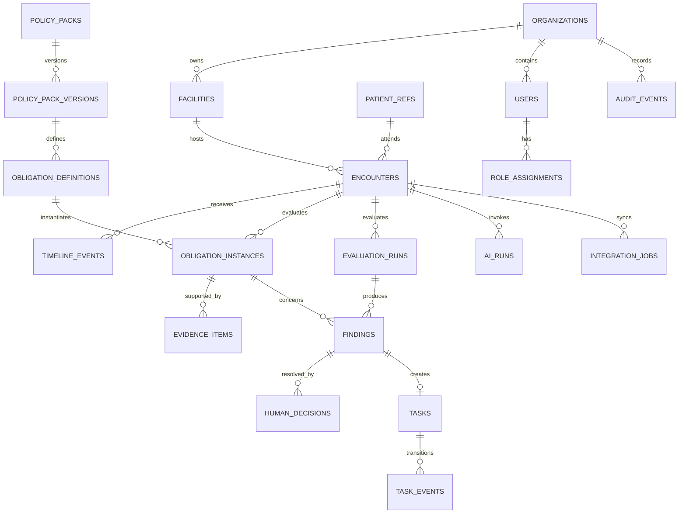

# CareGuard — Đặc tả Database

> Phiên bản: 1.0
> Ngày: 17/07/2026
> Database: PostgreSQL 16+
> Tài liệu nguồn: [Đặc tả sản phẩm](2026-07-17-clinical-compliance-copilot-design.md)

## 1. Mục tiêu

Database phải trả lời được toàn bộ chuỗi:

> Policy version nào áp dụng → obligation nào được tạo → evidence nào được dùng → rule kết luận gì → ai đã xử lý → task/follow-up kết thúc ra sao.

MVP dùng một PostgreSQL database. Không cần database riêng cho audit, graph hoặc vector. `pgvector` chỉ được bật nếu semantic retrieval thực sự được dùng; full-text search của PostgreSQL đủ cho metadata và policy search ban đầu.

## 2. Quy ước

- Primary key: `uuid`, sinh tại application hoặc `gen_random_uuid()`.
- Thời gian: `timestamptz`, lưu UTC.
- Tên bảng/cột: `snake_case`.
- Mọi bảng nghiệp vụ có `organization_id` để cô lập tenant.
- Không lưu tên/MRN trực tiếp nếu chỉ cần reference; dùng `patient_refs`.
- `jsonb` chỉ dùng cho payload nguồn, rule expression và metadata thay đổi; dữ liệu cần join/filter phải có cột riêng.
- Không hard-delete audit, policy version đã publish hoặc human decision.
- Optimistic concurrency dùng `version integer` hoặc `updated_at` với `If-Match` ở API.

## 3. ERD



## 4. Bảng nền tảng và phân quyền

### `organizations`

| Cột | Kiểu | Ràng buộc |
| --- | --- | --- |
| id | uuid | PK |
| code | text | UNIQUE, NOT NULL |
| name | text | NOT NULL |
| status | text | CHECK `ACTIVE`, `SUSPENDED` |
| created_at | timestamptz | NOT NULL |

### `facilities`

`id`, `organization_id FK`, `code`, `name`, `timezone`, `status`, `created_at`.

Unique: `(organization_id, code)`.

### `users`

| Cột | Kiểu | Ghi chú |
| --- | --- | --- |
| id | uuid | PK |
| organization_id | uuid | FK, tenant boundary |
| external_subject | text | ID từ OIDC/SSO |
| display_name | text | Không dùng cho clinical identity mapping |
| status | text | `ACTIVE`, `DISABLED` |
| created_at | timestamptz | |

Unique: `(organization_id, external_subject)`.

### `role_assignments`

`id`, `organization_id`, `user_id`, `facility_id nullable`, `role`, `valid_from`, `valid_until`.

Role MVP: `RECEPTIONIST`, `ASSISTANT`, `CLINICIAN`, `COMPLIANCE`, `MANAGER`, `INTEGRATION_ADMIN`.

## 5. Patient và encounter

### `patient_refs`

| Cột | Kiểu | Ghi chú |
| --- | --- | --- |
| id | uuid | PK nội bộ |
| organization_id | uuid | FK |
| source_system | text | `MOCK`, `HIS`, `FHIR` |
| source_patient_id | text | Mã từ hệ thống nguồn; mã hóa/tokenize khi cần |
| display_hint | text | Dữ liệu tối thiểu để tránh chọn nhầm; không dùng trong log |
| created_at | timestamptz | |

Unique: `(organization_id, source_system, source_patient_id)`.

### `encounters`

| Cột | Kiểu | Ràng buộc |
| --- | --- | --- |
| id | uuid | PK |
| organization_id | uuid | NOT NULL |
| facility_id | uuid | FK |
| patient_ref_id | uuid | FK, NOT NULL |
| source_encounter_id | text | NOT NULL |
| specialty | text | `ENT`, `DERMATOLOGY`, `GYNECOLOGY` |
| encounter_type | text | NOT NULL |
| status | text | `OPEN`, `PRE_CLOSE`, `CLOSED`, `CANCELLED` |
| clinician_user_id | uuid | FK nullable đến khi assign |
| started_at | timestamptz | |
| closed_at | timestamptz | |
| version | integer | NOT NULL DEFAULT 1 |

Unique: `(organization_id, source_encounter_id)`. Không cho đổi `patient_ref_id` sau khi có timeline event; sai patient phải cancel/quarantine và tạo encounter mới.

### `timeline_events`

| Cột | Kiểu | Ghi chú |
| --- | --- | --- |
| id | uuid | PK |
| organization_id | uuid | |
| encounter_id | uuid | FK |
| logical_event_id | text | Idempotency từ source |
| event_type | text | Ví dụ `DOCUMENT_SIGNED`, `RESULT_RECEIVED` |
| source_system | text | |
| source_ref | text | Resource/document reference |
| occurred_at | timestamptz | Thời điểm nghiệp vụ |
| received_at | timestamptz | Thời điểm ingest |
| payload | jsonb | Mock/source payload đã lọc |
| payload_hash | text | Kiểm tra replay/conflict |
| correlation_id | uuid | Trace xuyên hệ thống |

Unique: `(organization_id, source_system, logical_event_id)`. Index: `(encounter_id, occurred_at)`, `(organization_id, event_type, occurred_at)`.

## 6. Policy và obligation

### `policy_documents`

`id`, `organization_id nullable`, `title`, `issuer`, `external_url`, `document_version`, `effective_from`, `effective_to`, `content_hash`, `created_at`.

Không sao chép toàn bộ nội dung có bản quyền nếu không được phép; lưu reference, excerpt được phép và hash.

### `policy_packs`

`id`, `organization_id`, `code`, `name`, `specialty`, `status`, `created_at`.

Unique: `(organization_id, code)`.

### `policy_pack_versions`

| Cột | Kiểu | Ghi chú |
| --- | --- | --- |
| id | uuid | PK |
| policy_pack_id | uuid | FK |
| version_number | integer | tăng tuần tự |
| lifecycle_state | text | `DRAFT`, `CLINICAL_REVIEW`, `APPROVED`, `PUBLISHED`, `RETIRED` |
| effective_from/to | timestamptz | |
| approved_by | uuid | FK user |
| approved_at | timestamptz | |
| config_hash | text | tái hiện evaluation |
| created_at | timestamptz | |

Unique: `(policy_pack_id, version_number)`. Chỉ một version Published có hiệu lực tại cùng thời điểm cho cùng pack; enforce bằng exclusion constraint hoặc transaction publish.

### `obligation_definitions`

| Cột | Kiểu | Ghi chú |
| --- | --- | --- |
| id | uuid | PK |
| policy_pack_version_id | uuid | FK |
| code | text | ổn định giữa các version |
| title | text | |
| phase | text | `INTAKE`, `SCREENING`, `EXAM`, `PLAN`, `PRE_CLOSE`, `FOLLOW_UP` |
| owner_role | text | |
| severity | text | `INFO`, `ADVISORY`, `REQUIRED`, `HARD_STOP` |
| applicability_rule | jsonb | DSL deterministic |
| evidence_rule | jsonb | loại/source/status/freshness cần thiết |
| due_offset_minutes | integer | nullable |
| override_policy | jsonb | quyền và reason codes |
| policy_document_id | uuid | FK |
| citation_locator | text | section/page/recommendation |
| display_order | integer | |

Unique: `(policy_pack_version_id, code)`.

### Rule DSL tối thiểu

```json
{
  "all": [
    {"field": "encounter.specialty", "eq": "ENT"},
    {"field": "encounter.status", "in": ["OPEN", "PRE_CLOSE"]}
  ]
}
```

Chỉ hỗ trợ `all`, `any`, `not`, `eq`, `in`, `exists`; không cho thực thi script tùy ý trong database.

## 7. Evaluation, evidence và finding

### `evaluation_runs`

`id`, `organization_id`, `encounter_id`, `policy_pack_version_id`, `trigger_event_id nullable`, `mode`, `rule_engine_version`, `status`, `correlation_id`, `started_at`, `completed_at`.

Mode: `INCREMENTAL`, `PRE_CLOSE`, `SHADOW`. Status: `RUNNING`, `COMPLETED`, `FAILED`. Mỗi finding phải trỏ về evaluation run để có thể tái hiện kết quả.

### `obligation_instances`

| Cột | Kiểu | Ghi chú |
| --- | --- | --- |
| id | uuid | PK |
| organization_id | uuid | |
| encounter_id | uuid | FK |
| obligation_definition_id | uuid | FK, pin version |
| state | text | state machine chuẩn |
| due_at | timestamptz | |
| current_owner_user_id | uuid | nullable |
| current_owner_role | text | |
| last_evaluated_at | timestamptz | |
| evaluation_version | integer | optimistic concurrency |

Unique: `(encounter_id, obligation_definition_id)`.

### `evidence_items`

| Cột | Kiểu | Ghi chú |
| --- | --- | --- |
| id | uuid | PK |
| organization_id | uuid | |
| obligation_instance_id | uuid | FK |
| evidence_type | text | `STRUCTURED`, `SIGNED_DOCUMENT`, `EVENT`, `ATTESTATION`, `AI_EXTRACTED` |
| source_ref | text | không chứa payload nhạy cảm nếu tránh được |
| source_status | text | Draft/Signed/Final... |
| source_span | jsonb | offsets/page/field path |
| observed_at | timestamptz | freshness |
| actor_user_id | uuid | nullable |
| ai_run_id | uuid | nullable |
| content_hash | text | provenance |
| valid | boolean | kết quả validation |

Index: `(obligation_instance_id, valid, observed_at desc)`.

### `findings`

`id`, `organization_id`, `obligation_instance_id`, `state`, `reason_code`, `explanation`, `severity`, `evaluation_run_id`, `opened_at`, `resolved_at`, `superseded_by_id`.

Một obligation có nhiều finding lịch sử nhưng chỉ một finding hiện tại chưa superseded. Dùng partial unique index trên `obligation_instance_id WHERE superseded_by_id IS NULL`.

### `human_decisions`

`id`, `organization_id`, `finding_id`, `decision`, `reason_code`, `reason_text`, `actor_user_id`, `authentication_context`, `created_at`.

Decision: `RESOLVE`, `NOT_APPLICABLE`, `OVERRIDE`, `REJECT_AI_EVIDENCE`. Bảng append-only.

## 8. Task và handoff

### `tasks`

| Cột | Kiểu |
| --- | --- |
| id | uuid |
| organization_id | uuid |
| finding_id | uuid UNIQUE |
| encounter_id | uuid |
| task_type | text |
| status | text |
| owner_user_id | uuid nullable |
| owner_role | text |
| due_at | timestamptz |
| acknowledged_at | timestamptz nullable |
| escalation_level | integer default 0 |
| idempotency_key | text |
| created_at/updated_at/closed_at | timestamptz |

Status: `OPEN`, `ACKNOWLEDGED`, `IN_PROGRESS`, `COMPLETED`, `CANCELLED`, `ESCALATED`.

Unique: `(organization_id, idempotency_key)`. Index queue: `(organization_id, owner_user_id, status, due_at)` và `(organization_id, owner_role, status, due_at)`.

### `task_events`

Append-only: `id`, `task_id`, `event_type`, `from_status`, `to_status`, `actor_user_id`, `reason`, `created_at`.

## 9. AI, integration và audit

### `ai_runs`

`id`, `organization_id`, `encounter_id`, `task_type`, `model_provider`, `model_name`, `model_version`, `prompt_version`, `policy_pack_version_id`, `input_hash`, `output_hash`, `status`, `abstain_reason`, `latency_ms`, `token_usage`, `created_at`.

Không lưu raw prompt/output tại đây. Nội dung nhạy cảm, nếu bắt buộc giữ để QA, phải ở object storage mã hóa với retention riêng và access audit.

### `integration_jobs`

`id`, `organization_id`, `encounter_id`, `direction`, `connector`, `artifact_type`, `artifact_id`, `idempotency_key`, `status`, `attempt_count`, `next_attempt_at`, `last_error_code`, `ack_ref`, `correlation_id`, timestamps.

Status: `QUEUED`, `PROCESSING`, `ACKED`, `RETRYING`, `DEAD_LETTER`, `CANCELLED`.

### `audit_events`

| Cột | Kiểu | Ghi chú |
| --- | --- | --- |
| id | uuid | UUIDv7 hoặc sequence-friendly UUID |
| organization_id | uuid | |
| actor_type/id | text/uuid | USER, SERVICE, SYSTEM |
| action | text | |
| object_type/id | text/uuid | |
| purpose | text | |
| result | text | SUCCESS/DENIED/FAILED |
| correlation_id | uuid | |
| metadata | jsonb | allowlist, không PHI body |
| occurred_at | timestamptz | |
| previous_hash/event_hash | text | tamper evidence tùy deployment |

Không UPDATE/DELETE qua application role. Partition theo tháng khi dữ liệu đủ lớn; chưa cần ở prototype.

## 10. Row-level security và quyền DB

- Application transaction luôn đặt `app.organization_id` từ token đã xác thực.
- RLS policy bắt buộc `organization_id = current_setting('app.organization_id')::uuid`.
- Service role riêng cho migration, application, worker và read-only analytics.
- Application role không có quyền `TRUNCATE`, sửa policy version Published hoặc sửa audit/human decision.
- Analytics đọc view đã loại patient reference và text nhạy cảm.

## 11. Retention

| Dữ liệu | Mặc định thiết kế |
| --- | --- |
| Mock encounter | Xóa sau demo/test cycle |
| Timeline payload | Theo policy cơ sở; ưu tiên giữ reference/hash |
| Evidence metadata | Theo encounter/audit policy |
| AI raw input/output | Không lưu mặc định |
| AI run metadata | Giữ để trace model/version |
| Policy/version/decision/audit | Không hard-delete trong thời gian retention được duyệt |
| Task | Archive sau khi đóng; giữ transition history |

Retention thực tế cần Legal/DPO phê duyệt; không hard-code một TTL cho mọi artifact.

## 12. Migration và seed prototype

Migration 001 tạo extension cần thiết, enum/check constraints và các bảng theo thứ tự FK. Seed chỉ gồm:

- Một organization và facility giả lập.
- Sáu role user giả lập.
- Ba Policy Pack Draft/Published: ENT ear pain, acne, cervical screening.
- Ba encounter JSON không chứa PHI.
- Một bộ finding minh họa cho Missing, Unverified và Follow-up.

Không seed thuốc, liều hoặc clinical rule chưa được duyệt.

## 13. Database acceptance tests

1. Cùng logical event ingest ba lần chỉ tạo một `timeline_events` row.
2. Cùng evaluation chạy lại không tạo obligation instance hoặc task trùng.
3. Encounter không thể đổi patient sau khi có event.
4. Chỉ version Published và đang hiệu lực được chọn.
5. Policy v2 không thay FK của obligation instance đã tạo từ v1.
6. Chỉ một current finding tồn tại cho một obligation.
7. Hard-stop override không thể ghi nếu actor thiếu role hoặc reason.
8. Cross-tenant SELECT/UPDATE bị RLS từ chối.
9. Application role không thể UPDATE/DELETE audit event hoặc human decision.
10. Task transition không hợp lệ bị chặn ở service và DB constraint phù hợp.
11. AI run abstain không tạo AI-extracted evidence hợp lệ.
12. Analytics view không lộ source patient ID, note body hoặc source span text.

## 14. Quyết định thiết kế

- PostgreSQL duy nhất cho MVP; chưa cần graph database, Kafka hay audit database riêng.
- Obligation graph được biểu diễn bằng quan hệ và rule JSON, không cần graph engine.
- Audit append-only trong cùng database; nâng lên WORM/archive khi yêu cầu compliance thực tế xuất hiện.
- JSON payload được giữ tối thiểu; source system vẫn là system of record.
- Constraint và unique index chịu trách nhiệm chống trùng; không dựa riêng vào application check.
